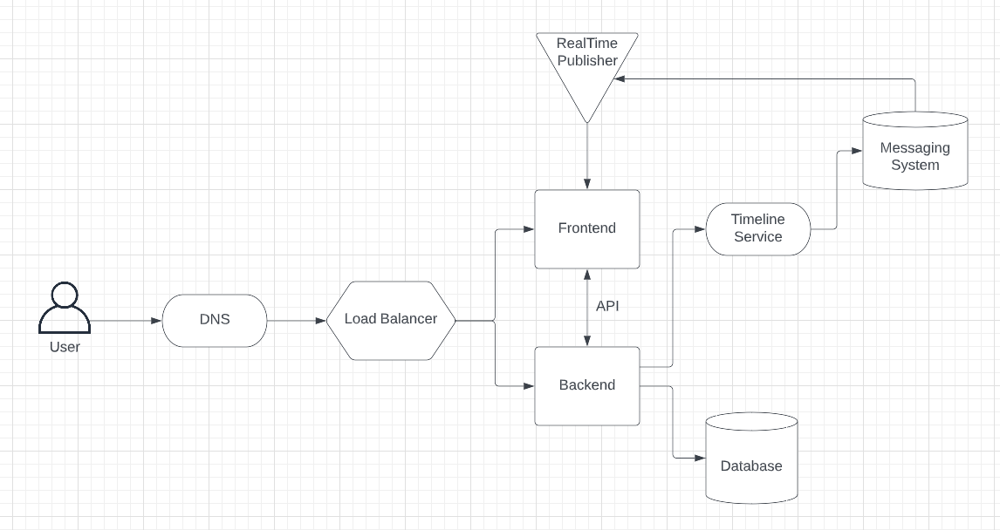
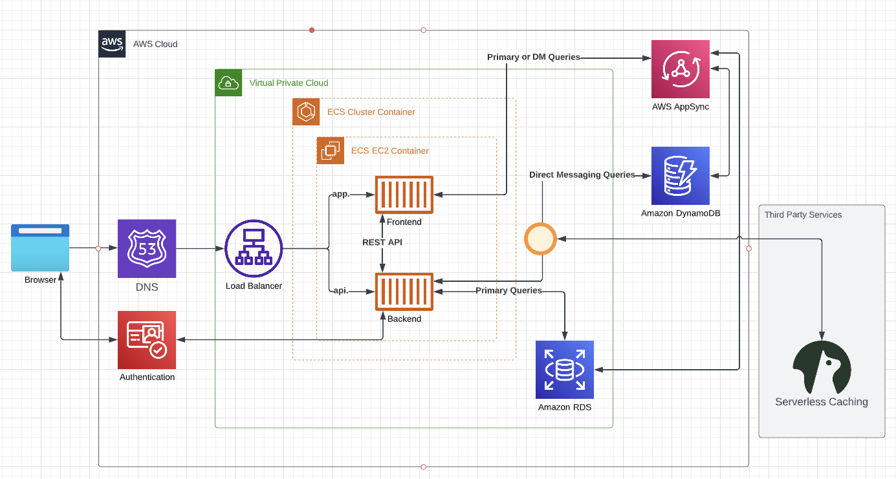
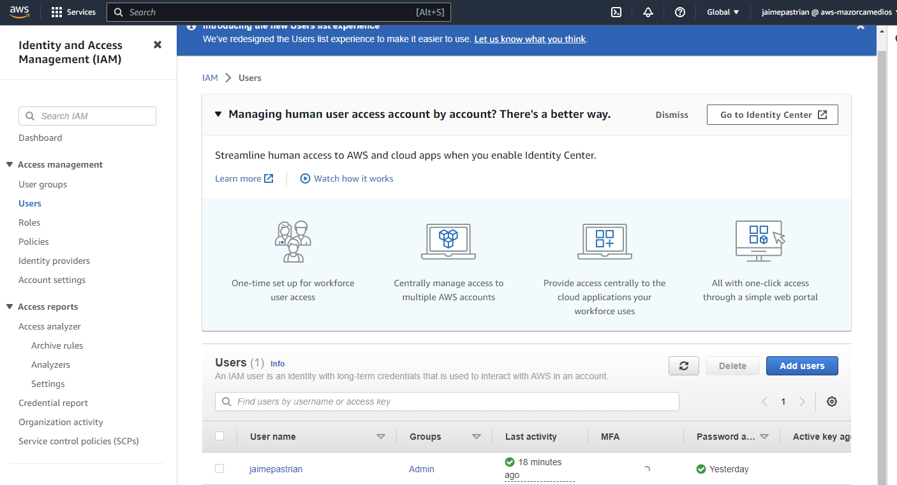
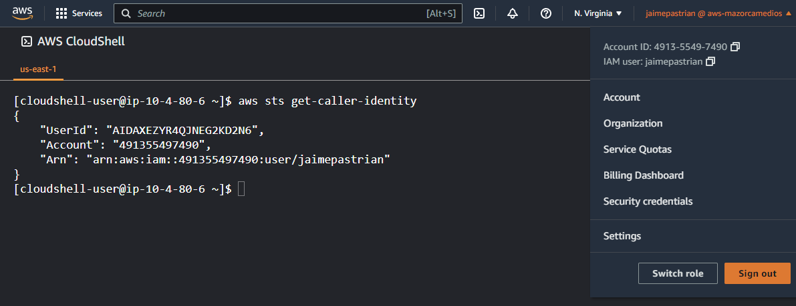
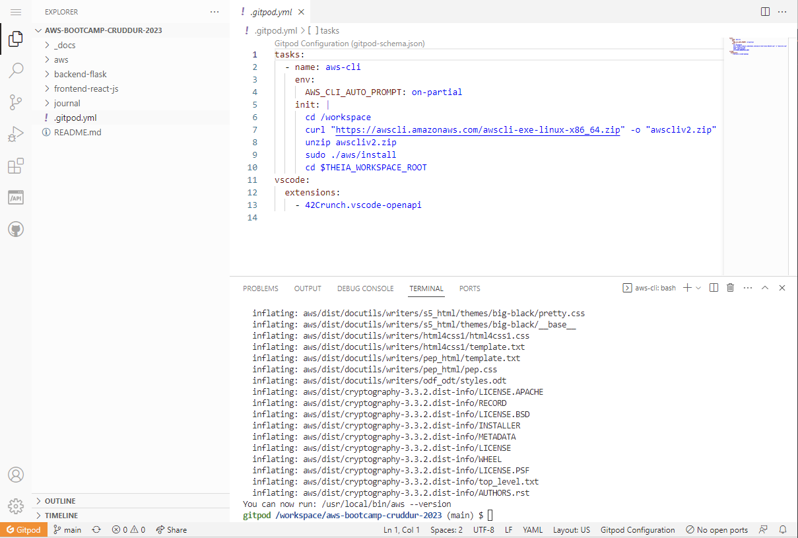
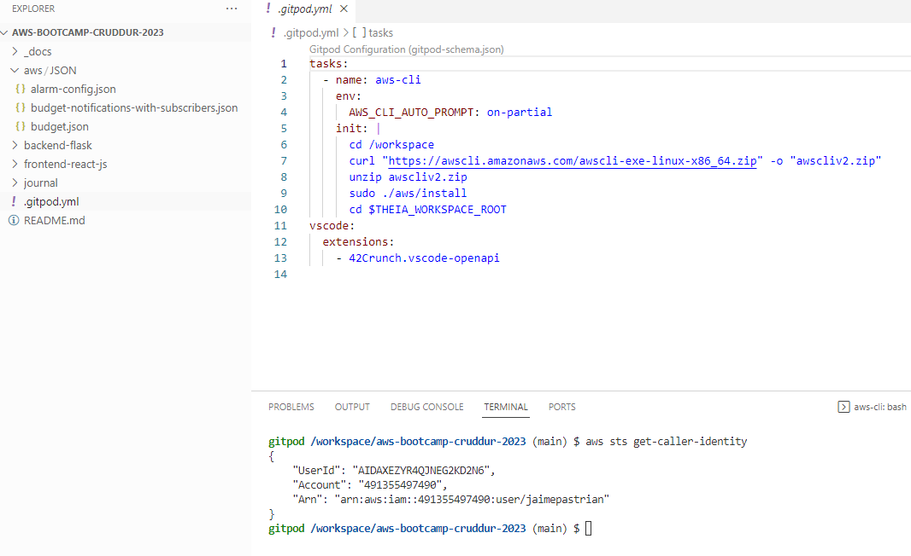
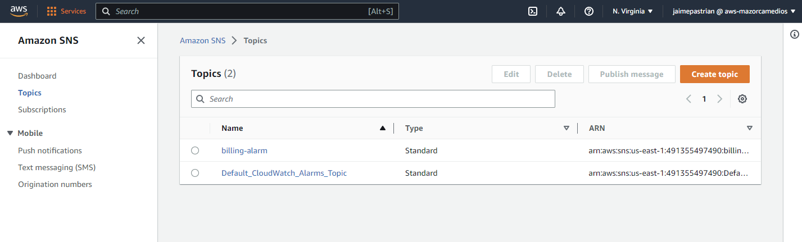
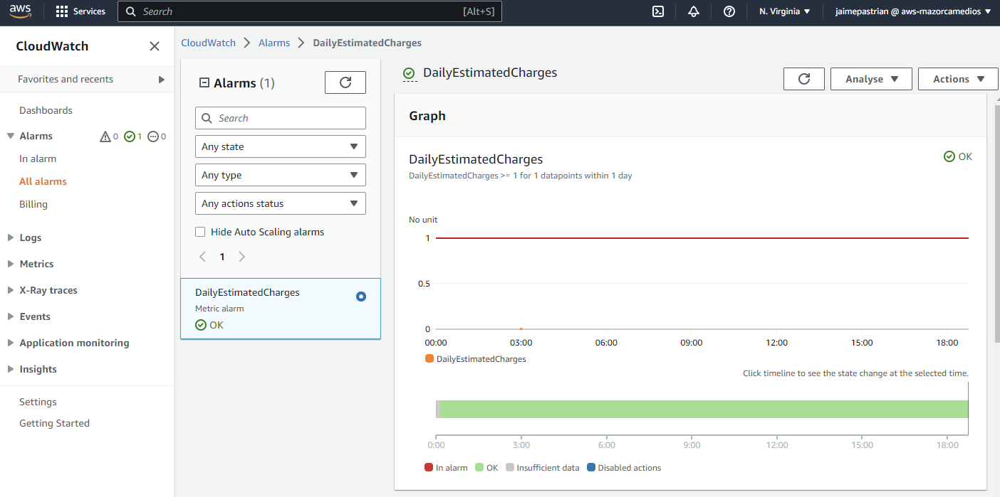
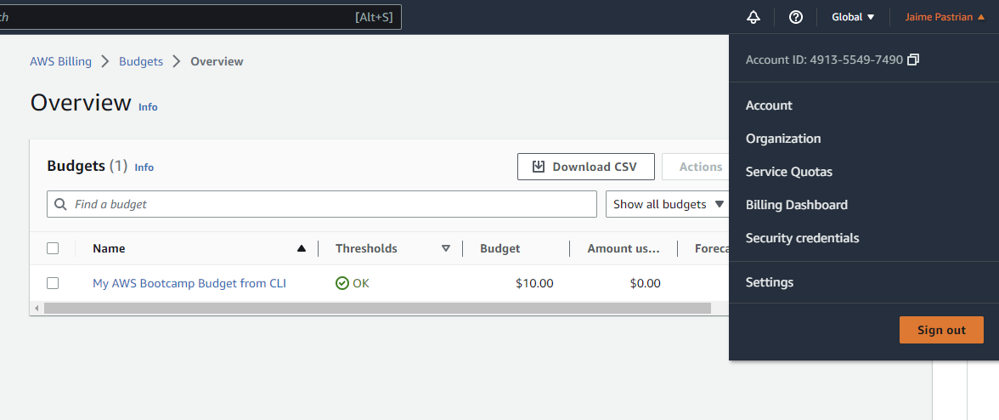
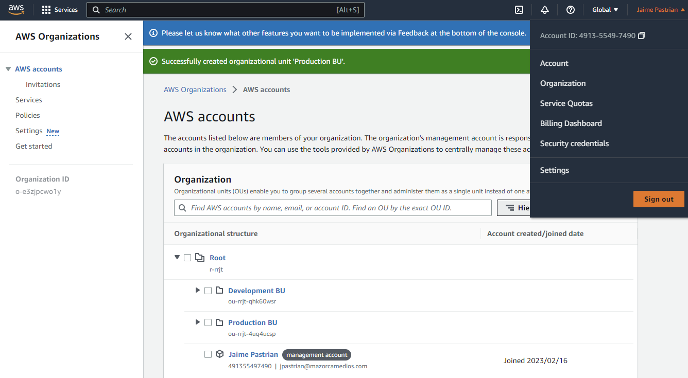

# Week 0 — Billing and Architecture

## Conceptual Diagram in Lucid Charts

This is my conceptual diagram for the Cruddur App:



[You can see the diagram on Lucid Charts here - CLICK THIS LINK](https://lucid.app/lucidchart/070a5fae-7049-431b-a806-348927ec96ea/edit?viewport_loc=55%2C-41%2C1391%2C900%2C0_0&invitationId=inv_045dd7fd-d6ac-4f16-999d-7f11b1c220ef)


## Logical Architectual Diagram

Here is the logical architectual diagram made with Lucid Charts.



[You can see the logical architectual diagram on Lucid Charts here - CLICK THIS LINK](https://lucid.app/lucidchart/f86f173f-eefc-41f1-ab21-7d27751636cc/edit?viewport_loc=-60%2C24%2C1847%2C900%2C0_0&invitationId=inv_faf9ffd9-4a66-4aa4-84a6-83f4a5da6663)


## Create an Admin User

I created an admin user and an admin user group thru AWS IAM dashboard. I gave proper admin access credentials to the group, applying <code>AdministratorAccess</code>, and then put the admin user into the group.
I also config MFA security to my root and IAM user.




## Use CloudShell

I succesfully used the AWS CloudShell in my account.



## Installed AWS CLI

### Generate AWS Credentiales

I created AWS Credentiales for the admin user in the IAM AWS Dashboard.

### Getting the AWS CLI Working

**_This one was a fun one!!_**

First I add to the .gitpod.yml file this code, to automatize the installation every time our Gitpod environment launches.
```yaml
    tasks:
    - name: aws-cli
        env:
        AWS_CLI_AUTO_PROMPT: on-partial
        init: |
        cd /workspace
        curl "https://awscli.amazonaws.com/awscli-exe-linux-x86_64.zip" -o "awscliv2.zip"
        unzip awscliv2.zip
        sudo ./aws/install
        cd $THEIA_WORKSPACE_ROOT
```

#### Set Env Vars

I had to set my AWS credentials in the terminal with this lines:
```bash
    export AWS_ACCESS_KEY_ID=""
    export AWS_SECRET_ACCESS_KEY=""
    export AWS_DEFAULT_REGION=us-east-1
```
But they didn't saved when I closed gitpod, so to ensure that, I created these variables as a environment variables with this code:
```bash
    gp env AWS_ACCESS_KEY_ID=""
    gp env AWS_SECRET_ACCESS_KEY=""
    gp env AWS_DEFAULT_REGION=us-east-1
```
So, now that it's working I check with this line of code in the terminal.
```bash
    aws sts get-caller-identity
```
Here is the screenshot of the AWS CLI working in gitpod.





## Billing Alarms

So I did it both ways, first, I created a billing alarm in the AWS Dashboard. Then I did it thru AWS CLI.

### Create a Billing Alarm thru AWS CLI

- **Create SNS Topic:** It's necessary to create a SNS Topic before you create an alarm. This command return a TopicARN, that you need to use in the next step. I did it with this line in the shell:

    aws sns create-topic --name billing-alarm



- **Create a subscription:** You need to provide the TopicARN and email to create a subscriptions. Once is created, you need to confirm the subscription in the email that you received in yout email account. This is the line to create a subscription:
```bash
    aws sns subscribe --topic-arn TopicARN --protocol email --notification-endpoint email@comany.com
```

- **Create the billing alarm:** You need to create a JSON file with the parameters you like to config the alarm. This is my JSON file:
```json
    {
        "AlarmName": "DailyEstimatedCharges",
        "AlarmDescription": "This alarm would be triggered if the daily estimated charges exceeds 1$",
        "ActionsEnabled": true,
        "AlarmActions": [
            "arn:aws:sns:us-east-1:491355497490:billing-alarm"
        ],
        "EvaluationPeriods": 1,
        "DatapointsToAlarm": 1,
        "Threshold": 1,
        "ComparisonOperator": "GreaterThanOrEqualToThreshold",
        "TreatMissingData": "breaching",
        "Metrics": [{
            "Id": "m1",
            "MetricStat": {
                "Metric": {
                    "Namespace": "AWS/Billing",
                    "MetricName": "EstimatedCharges",
                    "Dimensions": [{
                        "Name": "Currency",
                        "Value": "USD"
                    }]
                },
                "Period": 86400,
                "Stat": "Maximum"
            },
            "ReturnData": false
        },
        {
            "Id": "e1",
            "Expression": "IF(RATE(m1)>0,RATE(m1)*86400,0)",
            "Label": "DailyEstimatedCharges",
            "ReturnData": true
        }]
    }
```



## AWS Budget

For this, you need to create 2 JSON files with the config:

- budget.json
```json
    {
        "BudgetLimit": {
            "Amount": "10",
            "Unit": "USD"
        },
        "BudgetName": "My AWS Bootcamp Budget from CLI",
        "BudgetType": "COST",
        "CostFilters": {
            "TagKeyValue": [
                "user:Key$value1",
                "user:Key$value2"
            ]
        },
        "CostTypes": {
            "IncludeCredit": true,
            "IncludeDiscount": true,
            "IncludeOtherSubscription": true,
            "IncludeRecurring": true,
            "IncludeRefund": true,
            "IncludeSubscription": true,
            "IncludeSupport": true,
            "IncludeTax": true,
            "IncludeUpfront": true,
            "UseBlended": false
        },
        "TimePeriod": {
            "Start": 1477958399,
            "End": 3706473600
        },
        "TimeUnit": "MONTHLY"
    }
```

- budget-notifications-with-subscribers.json
```json
    [
        {
            "Notification": {
                "ComparisonOperator": "GREATER_THAN",
                "NotificationType": "ACTUAL",
                "Threshold": 50,
                "ThresholdType": "PERCENTAGE"
            },
            "Subscribers": [
                {
                    "Address": "youremail@company.com",
                    "SubscriptionType": "EMAIL"
                }
            ]
        }
    ]
```

I personally created this two files in the aws/JSON folder. This is very important to know, you must provide the path for each file in the next command, to be able to succesfully create the budget. You also need your AWS account ID.
```bash
    aws budgets create-budget \
        --account-id YourAccountId \
        --budget file://aws/JSON/budget.json \
        --notifications-with-subscribers file://aws/JSON/budget-notifications-with-subscribers.json
```




## Organizational Structure

I created an organizational structure in my account.

