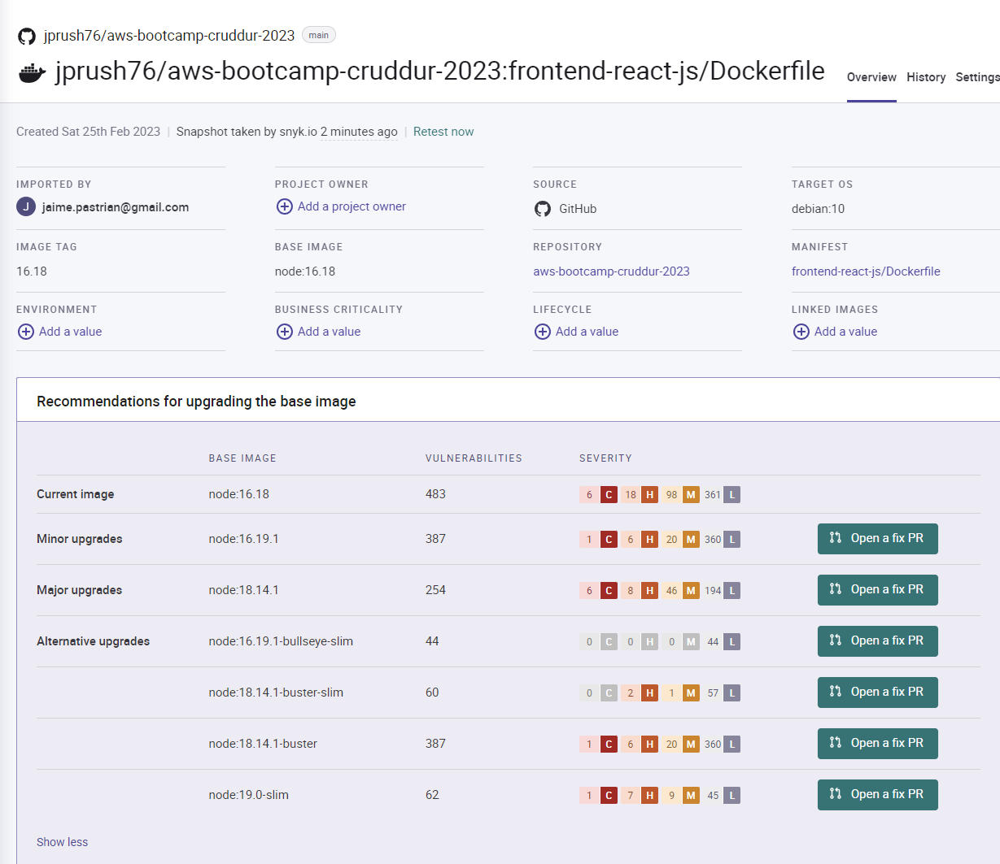
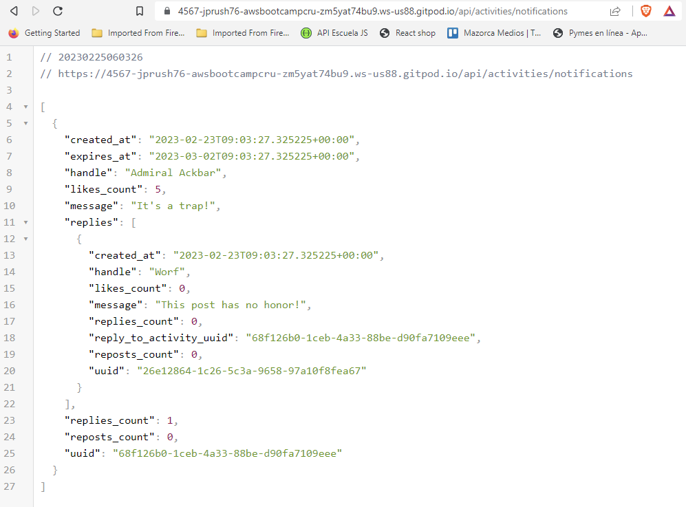
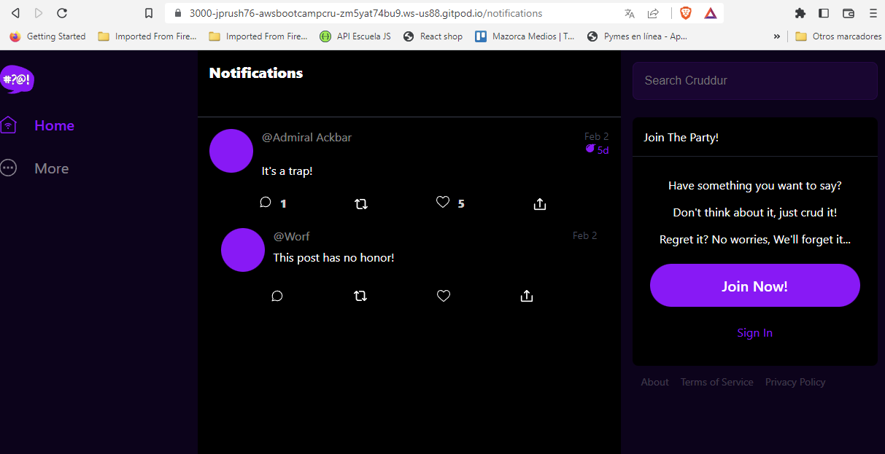
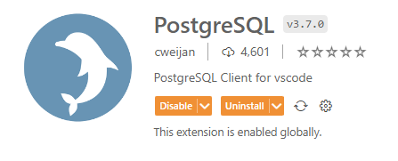
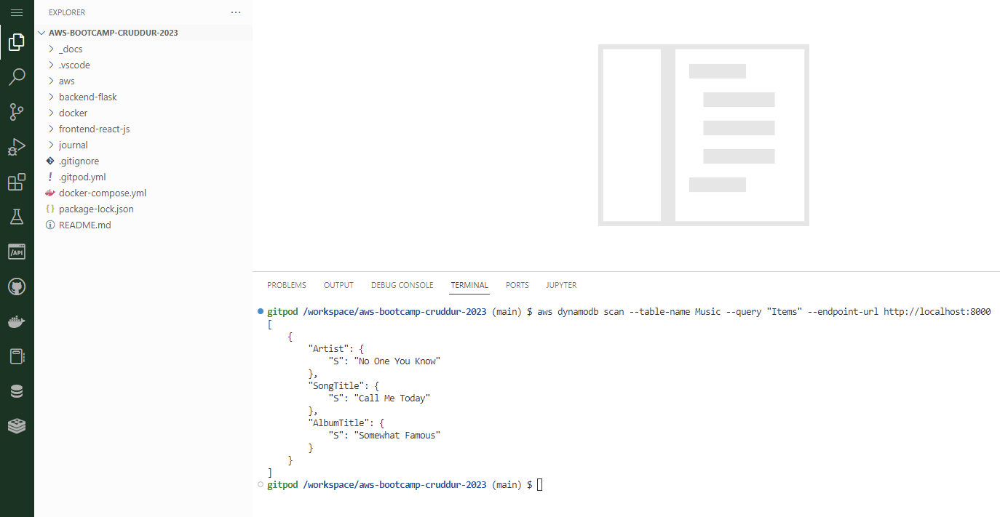

# Week 1 — App Containerization

 ## Containerize Application

### Dockerfile Backend

```docker
FROM python:3.10-slim-buster

# Inside container
# make a new folder inside container
WORKDIR /backend-flask

# Outside Container -> Inside Container
# this contains the libraries want to install to run the app
COPY requirements.txt requirements.txt

# inside Container
# Install the python libraries used for the app
RUN pip3 install -r requirements.txt

# . means everything in the current directory
# first period /backend-flask (outside container)
# second period /backend-flask (inside container)
COPY . .

# Environment variables (Env vars)
ENV FLASK_ENV=development

EXPOSE ${PORT}

# python3 -m flask run --host=0.0.0.0 --port=4567
CMD [ "python3", "-m" , "flask", "run", "--host=0.0.0.0", "--port=4567"]
```

### Dockerfile Frontend

```docker
FROM node:16.18

ENV PORT=3000

COPY . /frontend-react-js
WORKDIR /frontend-react-js
RUN npm install
EXPOSE ${PORT}
CMD ["npm", "start"]

```

### docker-compose for multiple containers
```docker
version: "3.8"
services:
  backend-flask:
    environment:
      FRONTEND_URL: "https://3000-${GITPOD_WORKSPACE_ID}.${GITPOD_WORKSPACE_CLUSTER_HOST}"
      BACKEND_URL: "https://4567-${GITPOD_WORKSPACE_ID}.${GITPOD_WORKSPACE_CLUSTER_HOST}"
    build: ./backend-flask
    ports:
      - "4567:4567"
    volumes:
      - ./backend-flask:/backend-flask
  frontend-react-js:
    environment:
      REACT_APP_BACKEND_URL: "https://4567-${GITPOD_WORKSPACE_ID}.${GITPOD_WORKSPACE_CLUSTER_HOST}"
    build: ./frontend-react-js
    ports:
      - "3000:3000"
    volumes:
      - ./frontend-react-js:/frontend-react-js

# the name flag is a hack to change the default prepend folder
# name when outputting the image names
networks: 
  internal-network:
    driver: bridge
    name: cruddur
```

## Project Snyk verification for vulnerabilities

I did a scan of the repository with Snyk, looking for vulnerabilities, and I found several vulnerabilities, with diferent types of severity.

The primary problem of the repository, is the Node image that the container is loading.

If we change the node version, we can solve the majority of the issues.

Screenshot:




## Adding an Endpoint for notifications

I successfully added an Endpoint to the backend for notifications.
`/api/activities/notifications`

Screenshot of the endpoint giving out notifications data:




## Adding a notifications page in the frontend

I successfully added a notifications page in the frontend.
`/notifications`

Screenshot of the notifications page in the frontend with data:




## Add Postgres

As we need to use `Postgres` locally, I add it by a container. So here it is the code that we need to add to our docker compose file:

```yaml
    services:
    db:
        image: postgres:13-alpine
        restart: always
        environment:
            - POSTGRES_USER=postgres
            - POSTGRES_PASSWORD=password
        ports:
            - '5432:5432'
        volumes: 
            - db:/var/lib/postgresql/data
    volumes:
    db:
        driver: local
```

When `Postgres` is running in gitpod, we have two methods to test locally if it's working.

### Postgres VS Code Extension
You must add a DB extension to your VS Code in Gitpod to test the `Postgres` connection. I chose this one:



Then you try to connect to `Postgres`:


### Run Postgres Client

If you want to use `Postgres` client in gitpod, you need to install it first. So I add this lines of code to my `gitpod.yml` to automate its installation at the start of gitpod.

```yaml
    - name: postgres
        init: |
        curl -fsSL https://www.postgresql.org/media/keys/ACCC4CF8.asc|sudo gpg --dearmor -o /etc/apt/trusted.gpg.d/postgresql.gpg
        echo "deb http://apt.postgresql.org/pub/repos/apt/ `lsb_release -cs`-pgdg main" |sudo tee  /etc/apt/sources.list.d/pgdg.list
        sudo apt update
        sudo apt install -y postgresql-client-13 libpq-dev
```

Then to start `Postgres` client you need to use `psql --host localhost`


## Install Dynamo DB Local
Same as `Postgres` I added Dynamo DB thru containers. Add this code to your `docker-compose.yml` file:

```yaml
services:
    dynamodb-local:
        # https://stackoverflow.com/questions/67533058/persist-local-dynamodb-data-in-volumes-lack-permission-unable-to-open-databa
        # We needed to add user:root to get this working.
        user: root
        command: "-jar DynamoDBLocal.jar -sharedDb -dbPath ./data"
        image: "amazon/dynamodb-local:latest"
        container_name: dynamodb-local
        ports:
            - "8000:8000"
        volumes:
            - "./docker/dynamodb:/home/dynamodblocal/data"
        working_dir: /home/dynamodblocal
```

Once your Dynamo DB container is running, you can:

### Create a table

```bash
aws dynamodb create-table \
    --endpoint-url http://localhost:8000 \
    --table-name Music \
    --attribute-definitions \
        AttributeName=Artist,AttributeType=S \
        AttributeName=SongTitle,AttributeType=S \
    --key-schema AttributeName=Artist,KeyType=HASH AttributeName=SongTitle,KeyType=RANGE \
    --provisioned-throughput ReadCapacityUnits=1,WriteCapacityUnits=1 \
    --table-class STANDARD
```

### Create an Item

```bash
aws dynamodb put-item \
    --endpoint-url http://localhost:8000 \
    --table-name Music \
    --item \
        '{"Artist": {"S": "No One You Know"}, "SongTitle": {"S": "Call Me Today"}, "AlbumTitle": {"S": "Somewhat Famous"}}' \
    --return-consumed-capacity TOTAL  
```

### List Tables

```bash
aws dynamodb list-tables --endpoint-url http://localhost:8000
```

### Get Records
```bash
aws dynamodb scan --table-name Music --query "Items" --endpoint-url http://localhost:8000
```

__Screenshot of dynamo DB running and working in gitpod:__



### References
[https://github.com/100DaysOfCloud/challenge-dynamodb-local](https://github.com/100DaysOfCloud/challenge-dynamodb-local)

[https://docs.aws.amazon.com/amazondynamodb/latest/developerguide/DynamoDBLocal.html](https://docs.aws.amazon.com/amazondynamodb/latest/developerguide/DynamoDBLocal.html)

[https://docs.aws.amazon.com/amazondynamodb/latest/developerguide/Tools.CLI.html](https://docs.aws.amazon.com/amazondynamodb/latest/developerguide/Tools.CLI.html)