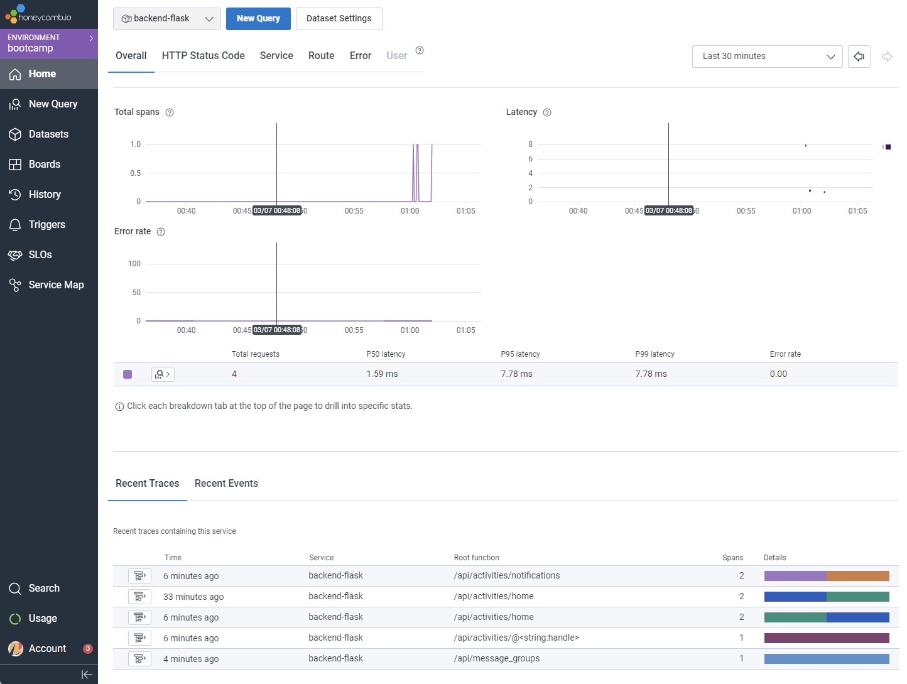
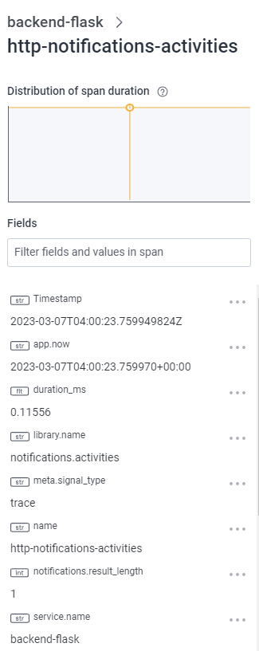
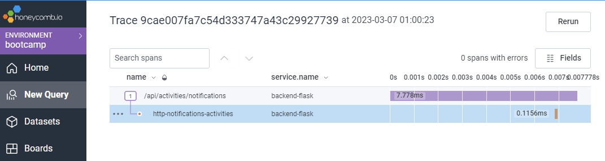
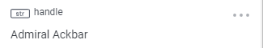
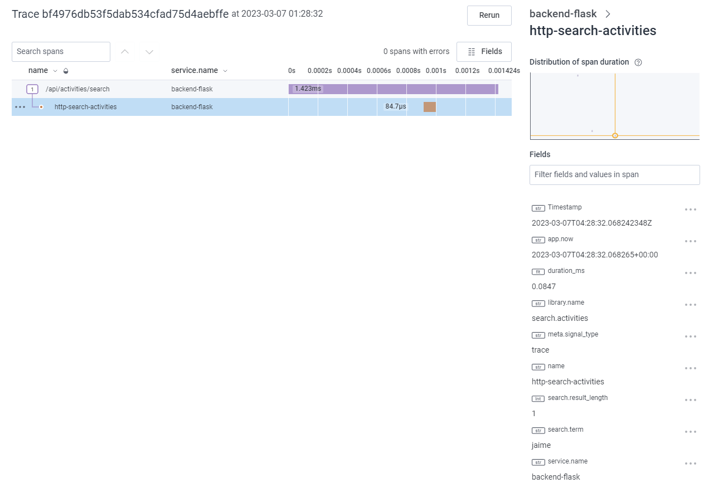

# Week 2 — Distributed Tracing

## Honeycomb

First of all, we installed Honeycomb, a great solution to see how our application works inside.
We can trace the user experience, errors, latency and much more with it.

To install Honeycomb in our backend, first we need to create an account in [Honeycomb.io](https://www.honeycomb.io/)

They have a really good free tier (20 Million events per Month)

### Honeycomb config

In our `backend` folder, we need to add these lines to `requirements.txt` file.

```
opentelemetry-api 
opentelemetry-sdk 
opentelemetry-exporter-otlp-proto-http 
opentelemetry-instrumentation-flask 
opentelemetry-instrumentation-requests
```

Then we will install these dependencies with this command in our terminal. To run this line, first we'll navigate into the folder `backend-flask` with the `cd` command.

```bash
pip install -r requirements.txt
```

Next step, we'll add these line to our `app.py` file:

```py
from opentelemetry import trace
from opentelemetry.instrumentation.flask import FlaskInstrumentor
from opentelemetry.instrumentation.requests import RequestsInstrumentor
from opentelemetry.exporter.otlp.proto.http.trace_exporter import OTLPSpanExporter
from opentelemetry.sdk.trace import TracerProvider
from opentelemetry.sdk.trace.export import BatchSpanProcessor
```

Then, we'll add these lines too in `app.py` file. Insert them before `app = Flask(__name__)`

```py
# Honeycomb
# Initialize tracing and an exporter that can send data to Honeycomb
provider = TracerProvider()
processor = BatchSpanProcessor(OTLPSpanExporter())
provider.add_span_processor(processor)
trace.set_tracer_provider(provider)
tracer = trace.get_tracer(__name__)
```

After `app = Flask(__name__)`, inserte these lines:
```py
#Honeycomb
FlaskInstrumentor().instrument_app(app)
RequestsInstrumentor().instrument()
```

#### CONFIG ENVIRONMENT VARIABLES FOR HONEYCOMB

We need to create these two env vars in our gitpod terminal. They are the Honeycomb service name and our Honeycomb API Key. So, in the gitpod terminal run these commands:

```bash
export HONEYCOMB_API_KEY="INSERT_YOUR_API_KEY_HERE"
export HONEYCOMB_SERVICE_NAME="backend-flask"
gp env HONEYCOMB_API_KEY="INSERT_YOUR_API_KEY_HERE"
gp env HONEYCOMB_SERVICE_NAME="backend-flask"
```

So, now that we have the env vars created in our gitpod, we'll add these lines to our project `docker-compose.yml`. Put it in `Service -> backend-flask -> environment`.

```yml
OTEL_SERVICE_NAME: 'backend-flask'
OTEL_EXPORTER_OTLP_ENDPOINT: "https://api.honeycomb.io"
OTEL_EXPORTER_OTLP_HEADERS: "x-honeycomb-team=${HONEYCOMB_API_KEY}"
```

And now, we are ready to create our first traces and spans.

### Creating our first trace and span

In all service file that you want to implement honeycomb's traces, please import OPTL with this line:

```py
#honeycomb
from opentelemetry import trace
```

In our `home_activities.py` file (inside `backend-flask/services` folder) insert this line right after `def run():`.

This `with` line wrap all the existing lines after `def run():`, so be carefull with indentation (This is Python!! 😉)

```py
with tracer.start_as_current_span("http-home-activities"):
```

So, now we'll create a span with relevant metadata for us. You can add all the attributes you think may be are relevant to the project.

Add these lines right after the `with` line and before the `result`:

```py
span = trace.get_current_span()
now = datetime.now(timezone.utc).astimezone()
span.set_attribute("app.now", now.isoformat())
```

And we are going to count all of the results that the backend is giving back in each petition. We can do this with this line. Add this line after the results list and before the `return`, at the end of the file:

```py
span.set_attribute("app.result_length", len(results))
```

Now, we just do a `docker compose up` in our terminal, to launch the app. Go to the home page in the frontend, refresh several times, and you will start receiving data in the Honeycomb dashboard. If you don't... you missed something or misspelled something... debug and try again!



### Additional Spans

For now, I created a few more traces and spans for the backend.

I added for the following services: notifications, messages_groups, users route (`@<string:handle>`) and finally search.

In this picture you can see the span details with the attributes that I created. You can see the name, app.now timestamp, library.name, service.name and notifications.result_length.





For the user service, I created an attribute to save the user handle `@<string:handle>`



In the search backend service, I did something different, I created an attribute to save the `search.term`. I think this info could be very important in the future. For research, marketing, etc... You can see it in the next picture:




