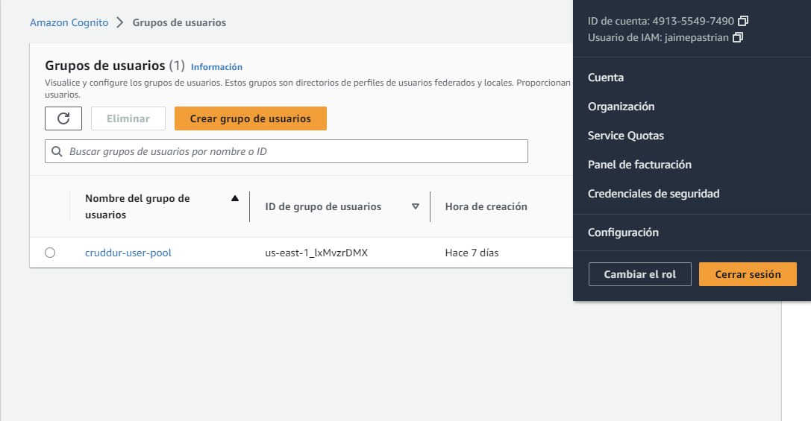
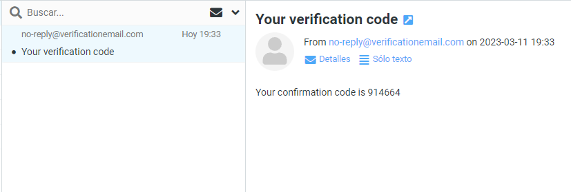
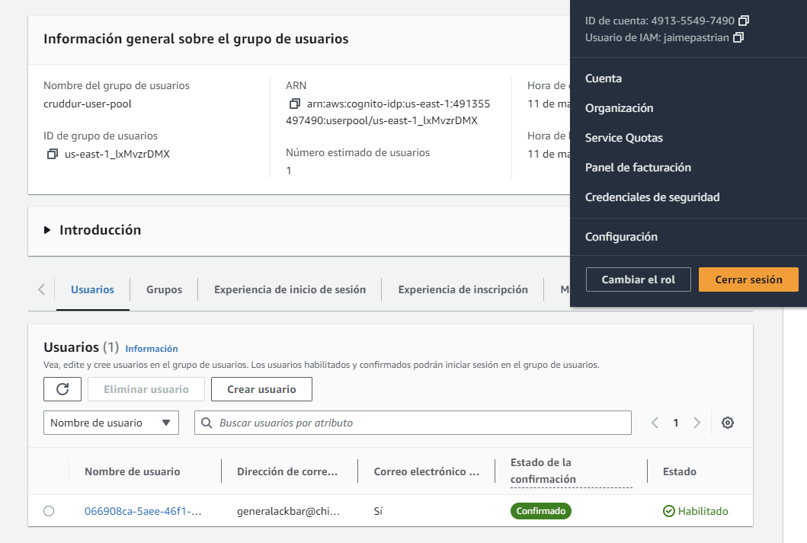
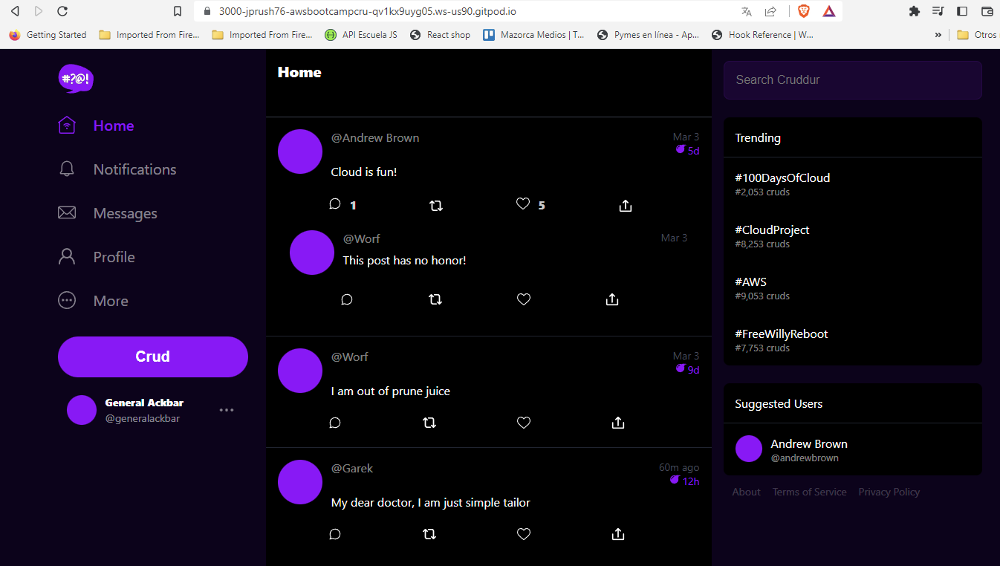
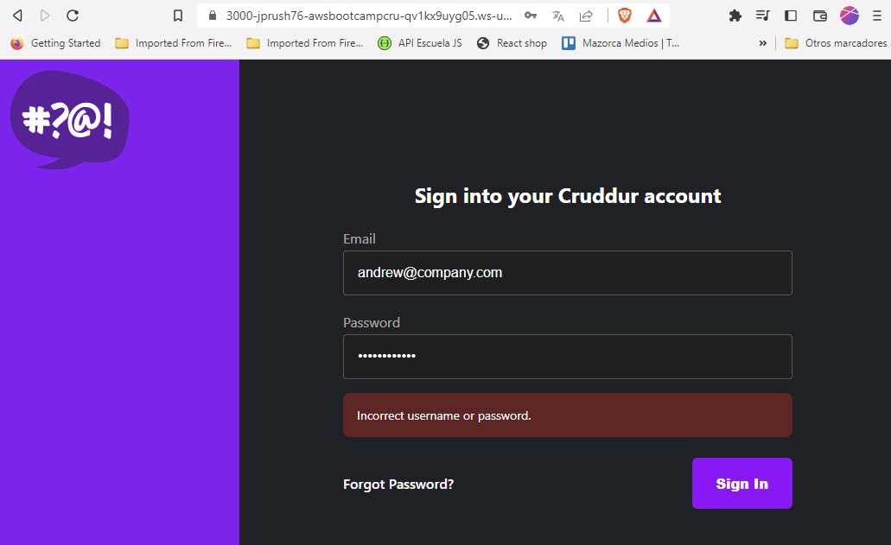
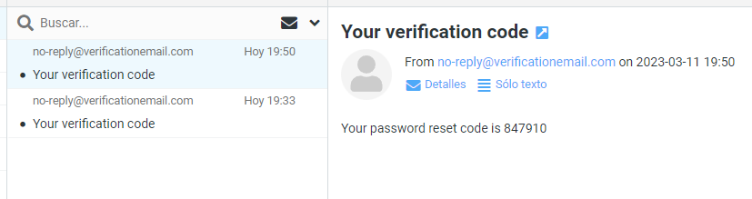
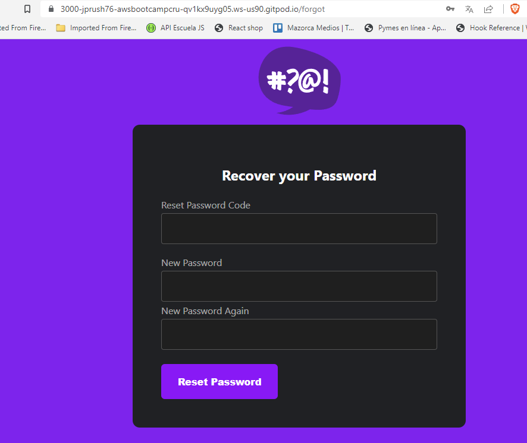
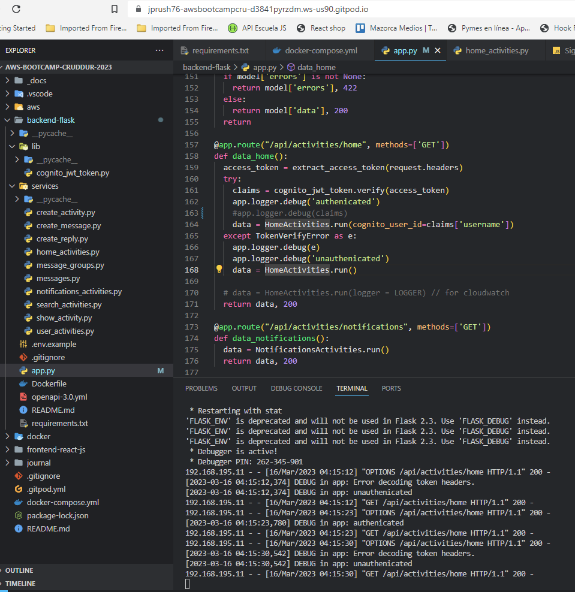
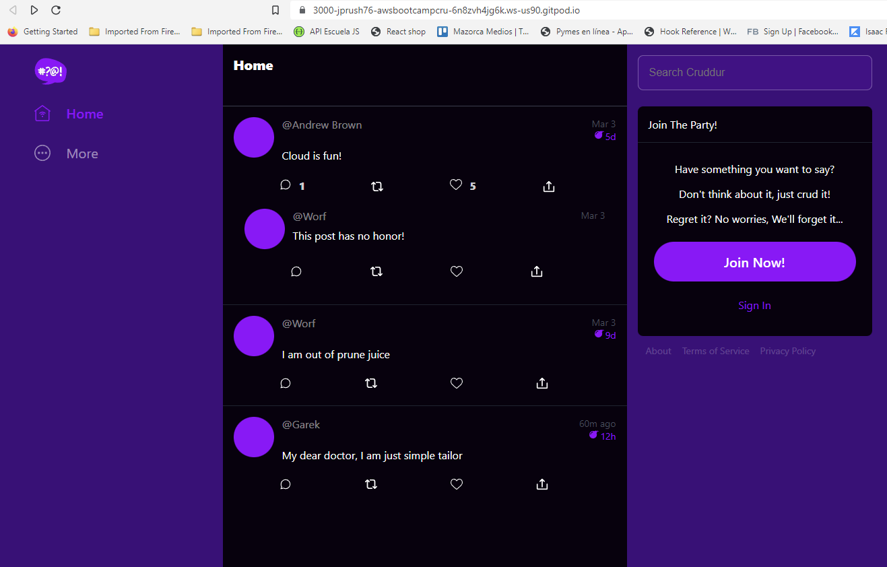

# Week 3 — Decentralized Authentication

## Cognito User Pool

We have to create a cognito user pool in our AWS Account.

Things to consider when we create the cognito user pool:

- 'Cognito user pool' is for web apps, when you want to create a login with user (or email) and password. In the other hand, 'Federated identity providers' is use when your users can login with their social identity providers, like google, facebook, github, etc.

- I our case, we only need to check the email option, we are not going to use the username, for simplicity.

- We are not going to use MFA in this project, but if you want to implement it, be aware that SMS messages can cost a lot of money, so I suggest using with Authentication App only.

- In 'Required attributes' section, we will add additional attributes 'preferred_username' and 'name'.

- We select 'Send email with cognito' as a Message delivery.

- Create the user pool in the AWS Region that you are working. In my case is 'us-east-1'

- Name of the pool: `cruddur-user-pool`

- Don't use Cognito Hosted UI, is best to create your own.

- In 'Initial app client' we select `Public client`

- App client name: `cruddur`

- We don't need 'Client secret'


When is created you are going to see something like this:




## AWS Amplify

So What is AWS Amplify? Is a sdk for a lot of common libraries, is a hosting plataform, is a way to provide serverless applications, and also a local solution. It is many thing at once, so is very difficult to understand.

__The only way to use Cognito on the client side (frontend), is  using amplify's javascript library.__

## Install AWS Amplify

Go to `frontend-react-js` folder in your gitpod terminal, ,and install amplify with this command:

```bash
npm i aws-amplify --save
```

After the installation, if you open your `package.json` you should see something like this:

```json
"dependencies": {
    "@testing-library/jest-dom": "^5.16.5",
    "@testing-library/react": "^13.4.0",
    "@testing-library/user-event": "^13.5.0",
    "aws-amplify": "^5.0.18",
    "js-cookie": "^3.0.1",
    "luxon": "^3.1.0",
    "process": "^0.11.10",
    "react": "^18.2.0",
    "react-dom": "^18.2.0",
    "react-router-dom": "^6.4.3",
    "react-scripts": "5.0.1",
    "web-vitals": "^2.1.4"
  },
```

## Configure Amplify

We need to open our `App.js` and add this:

```js
// Amplify
import { Amplify } from 'aws-amplify';
```

Then you can add these configuration lines after the import:
```js
Amplify.configure({
  "AWS_PROJECT_REGION": process.env.REACT_APP_AWS_PROJECT_REGION,
  "aws_cognito_region": process.env.REACT_APP_AWS_COGNITO_REGION,
  "aws_user_pools_id": process.env.REACT_APP_AWS_USER_POOLS_ID,
  "aws_user_pools_web_client_id": process.env.REACT_APP_CLIENT_ID,
  "oauth": {},
  Auth: {
    region: process.env.REACT_APP_AWS_PROJECT_REGION,           // REQUIRED - Amazon Cognito Region
    userPoolId: process.env.REACT_APP_AWS_USER_POOLS_ID,         // OPTIONAL - Amazon Cognito User Pool ID
    userPoolWebClientId: process.env.REACT_APP_CLIENT_ID,   // OPTIONAL - Amazon Cognito Web Client ID (26-char alphanumeric string)
  }
});
```

Now we need to create these constants in our `docker-compose.yml` inside `frontend-react-js` -> `environment`

```yaml
REACT_APP_AWS_PROJECT_REGION: "${AWS_DEFAULT_REGION}"
REACT_APP_AWS_COGNITO_REGION: "${AWS_DEFAULT_REGION}"
REACT_APP_AWS_USER_POOLS_ID: "us-east-1_lxMvzrDMX"
REACT_APP_CLIENT_ID: "___Your_client_id___"
```
You can find your client id in your cognito user pool. Go to app integration tab, and you will find the client id at the bottom of the page.

NOTE: You need to put REACT_APP_ in front of every constant to autoload them.


## Conditionally show components based on logged in or logged out

Let's go to our `pages/HomeFeedPage.js` and import the amplify library:

```js
import { Auth } from 'aws-amplify';
```

Then verify that this line is in your code, otherwise add it:

```js
const [user, setUser] = React.useState(null);
```

Next, replace the `checkAuth` function with these lines:

```js
// check if we are authenicated
  const checkAuth = async () => {
    Auth.currentAuthenticatedUser({
      // Optional, By default is false. 
      // If set to true, this call will send a 
      // request to Cognito to get the latest user data
      bypassCache: false 
    })
    .then((user) => {
      console.log('user',user);
      return Auth.currentAuthenticatedUser()
    }).then((cognito_user) => {
        setUser({
          display_name: cognito_user.attributes.name,
          handle: cognito_user.attributes.preferred_username
        })
    })
    .catch((err) => console.log(err));
  };
```

Then check if `checkAuth` function is initialized in `React.useEffect`

```js
React.useEffect(()=>{
    //prevents double call
    if (dataFetchedRef.current) return;
    dataFetchedRef.current = true;

    loadData();
    checkAuth();
  }, [])
```

Now we need to pass our user info to two components, check your code:

``` js
<DesktopNavigation user={user} active={'home'} setPopped={setPopped} />

<DesktopSidebar user={user} />
```

Now let's go to `components/ProfileInfo.js` and replace `import Cookies...` line with the Amplify's import:

```js
import { Auth } from 'aws-amplify';
```

Now replace `signOut` function, because we are no longer working with Cookies.

```js
const signOut = async () => {
    try {
        await Auth.signOut({ global: true });
        window.location.href = "/"
        localStorage.removeItem("access_token")
    } catch (error) {
        console.log('error signing out: ', error);
    }
  }
```

## Signin Page

Go to `pages/SigninPage.js` and replace `import Cookies...` line with the Amplify's import:

```js
import { Auth } from 'aws-amplify';
```

Next, change the code of `onsubmit` function with this:

```js
const onsubmit = async (event) => {
    setErrors('')
    event.preventDefault();
  
    Auth.signIn(email, password)
      .then(user => {
        console.log("User: ", user)
        localStorage.setItem("access_token", user.signInUserSession.accessToken.jwtToken)
        window.location.href = "/"
      })
      .catch(error => {
        //console.log('Error!', error)
        if (error.code == 'UserNotConfirmedException') {
          window.location.href = "/confirm"
        }
        setErrors(error.message)
      });
    return false
}
```

## Signup Page

Go to `pages/SignupPage.js` and replace `import Cookies...` line with the Amplify's import:

```js
import { Auth } from 'aws-amplify';
```

Replace `onsubmit` funtion with this:

```js
const onsubmit = async (event) => {
    event.preventDefault();
    setErrors('')
    try {
        const { user } = await Auth.signUp({
          username: email,
          password: password,
          attributes: {
              name: name,
              email: email,
              preferred_username: username,
          },
          autoSignIn: { // optional - enables auto sign in after user is confirmed
              enabled: true,
          }
        });
        console.log(user);
        window.location.href = `/confirm?email=${email}`
    } catch (error) {
        console.log(error);
        setErrors(error.message)
    }
    return false
}
```

## Confirmation Page

Go to `pages/ConfirmationPage.js` and replace `import Cookies...` line with the Amplify's import:

```js
import { Auth } from 'aws-amplify';
```

Replace `resend_code` funtion with this:

```js
const resend_code = async (event) => {
    setErrors('')
    try {
      await Auth.resendSignUp(email);
      console.log('code resent successfully');
      setCodeSent(true)
    } catch (err) {
      // does not return a code
      // does cognito always return english
      // for this to be an okay match?
      console.log(err)
      if (err.message == 'Username cannot be empty'){
        setErrors("You need to provide an email in order to send Resend Activiation Code")   
      } else if (err.message == "Username/client id combination not found."){
        setErrors("Email is invalid or cannot be found.")   
      }
    }
}
```

Then, replace `onsubmit` funtion with this:

```js
const onsubmit = async (event) => {
    event.preventDefault();
    setErrors('')
    try {
      await Auth.confirmSignUp(email, code);
      window.location.href = "/"
    } catch (error) {
      setErrors(error.message)
    }
    return false
}
```

So now, we can test if these changes are working ok. Go to your gitpod terminal and:

```bash
docker compose up
```

Try to create a user with the 'signup Page'. If everything is ok, you will see the verification page and you will receive an email with the confirmation code:



On the verification page put the code that you receive. If it works, you are going to see the homepage. You need to login now, go to the sigin page.

If the user was succesfully created, is going to appear in your cognito user pool dashboard:



Now, when you successfully login, your homepage is going to look something like this, with the extra info:



But if you put the wrong credentials on the signin page, you are going to see an error like this one:




## Recovery Page

Go to `pages/RecoverPage.js` and replace `import Cookies...` line with the Amplify's import:

```js
import { Auth } from 'aws-amplify';
```

Replace `onsubmit_send_code` with this:

```js
const onsubmit_send_code = async (event) => {
    event.preventDefault();
    setErrors('')
    Auth.forgotPassword(username)
    .then((data) => setFormState('confirm_code') )
    .catch((err) => setErrors(err.message) );
    return false
}
```

Replace `onsubmit_send_code` with this:

```js
const onsubmit_confirm_code = async (event) => {
    event.preventDefault();
    setErrors('')
    if (password == passwordAgain){
      Auth.forgotPasswordSubmit(username, code, password)
      .then((data) => setFormState('success'))
      .catch((err) => setErrors(err.message) );
    } else {
      setErrors('Passwords do not match')
    }
    return false
  }
```

Now we test it, go to recover password in the frontend, then put the user's email and send recovery code. You should receive an email with a code like this:



And you should see a form like this to reset the password:




## Passing the access token to the backend

we add a header to the api call in the `pages/HomeFeedPage.js` add the headers before the GET method:

```js
headers: {
    Authorization: `Bearer ${localStorage.getItem("access_token")}`
},
```

Now we replace `cors` in `app.py` with this code:

```py
cors = CORS(
  app, 
  resources={r"/api/*": {"origins": origins}},
  headers=['Content-Type', 'Authorization'], 
  expose_headers='Authorization',
  methods="OPTIONS,GET,HEAD,POST"
)
```

## Backend Auth

Add this line to `requirements.txt`

```bash
Flask-AWSCognito
```

Now, we will install this dependency with this command in our terminal. IMPORTANT: To run this line, first we'll navigate into the folder `backend-flask` with the `cd` command.

```bash
pip install -r requirements.txt
```

Add these constants in `docker-compose.yml`, inside `backend-flask` -> `environment`:

```yaml
AWS_COGNITO_USER_POOL_ID: "us-east-1_lxMvzrDMX"
AWS_COGNITO_USER_POOL_CLIENT_ID: "__Your_client_id__"
```

Next, create a new folder `lib` inside `backend-flask` folder, and create a new file inside 'lib' named `cognito_jwt_token.py`. Put this code in the new file:

```py
import time
import requests
from jose import jwk, jwt
from jose.exceptions import JOSEError
from jose.utils import base64url_decode

class FlaskAWSCognitoError(Exception):
    pass

class TokenVerifyError(Exception):
    pass

def extract_access_token(request_headers):
    access_token = None
    auth_header = request_headers.get("Authorization")
    if auth_header and " " in auth_header:
        _, access_token = auth_header.split()
    return access_token

class CognitoJwtToken:
    def __init__(self, user_pool_id, user_pool_client_id, region, request_client=None):
        self.region = region
        if not self.region:
            raise FlaskAWSCognitoError("No AWS region provided")
        self.user_pool_id = user_pool_id
        self.user_pool_client_id = user_pool_client_id
        self.claims = None
        if not request_client:
            self.request_client = requests.get
        else:
            self.request_client = request_client
        self._load_jwk_keys()

    def _load_jwk_keys(self):
        keys_url = f"https://cognito-idp.{self.region}.amazonaws.com/{self.user_pool_id}/.well-known/jwks.json"
        try:
            response = self.request_client(keys_url)
            self.jwk_keys = response.json()["keys"]
        except requests.exceptions.RequestException as e:
            raise FlaskAWSCognitoError(str(e)) from e

    @staticmethod
    def _extract_headers(token):
        try:
            headers = jwt.get_unverified_headers(token)
            return headers
        except JOSEError as e:
            raise TokenVerifyError(str(e)) from e

    def _find_pkey(self, headers):
        kid = headers["kid"]
        # search for the kid in the downloaded public keys
        key_index = -1
        for i in range(len(self.jwk_keys)):
            if kid == self.jwk_keys[i]["kid"]:
                key_index = i
                break
        if key_index == -1:
            raise TokenVerifyError("Public key not found in jwks.json")
        return self.jwk_keys[key_index]

    @staticmethod
    def _verify_signature(token, pkey_data):
        try:
            # construct the public key
            public_key = jwk.construct(pkey_data)
        except JOSEError as e:
            raise TokenVerifyError(str(e)) from e
        # get the last two sections of the token,
        # message and signature (encoded in base64)
        message, encoded_signature = str(token).rsplit(".", 1)
        # decode the signature
        decoded_signature = base64url_decode(encoded_signature.encode("utf-8"))
        # verify the signature
        if not public_key.verify(message.encode("utf8"), decoded_signature):
            raise TokenVerifyError("Signature verification failed")

    @staticmethod
    def _extract_claims(token):
        try:
            claims = jwt.get_unverified_claims(token)
            return claims
        except JOSEError as e:
            raise TokenVerifyError(str(e)) from e

    @staticmethod
    def _check_expiration(claims, current_time):
        if not current_time:
            current_time = time.time()
        if current_time > claims["exp"]:
            raise TokenVerifyError("Token is expired")  # probably another exception

    def _check_audience(self, claims):
        # and the Audience  (use claims['client_id'] if verifying an access token)
        audience = claims["aud"] if "aud" in claims else claims["client_id"]
        if audience != self.user_pool_client_id:
            raise TokenVerifyError("Token was not issued for this audience")

    def verify(self, token, current_time=None):
        """ https://github.com/awslabs/aws-support-tools/blob/master/Cognito/decode-verify-jwt/decode-verify-jwt.py """
        if not token:
            raise TokenVerifyError("No token provided")

        headers = self._extract_headers(token)
        pkey_data = self._find_pkey(headers)
        self._verify_signature(token, pkey_data)

        claims = self._extract_claims(token)
        self._check_expiration(claims, current_time)
        self._check_audience(claims)

        self.claims = claims
        return claims
```

Next create the import in `app.py`:

```py
from lib.cognito_jwt_token import CognitoJwtToken, extract_access_token, TokenVerifyError
```

Put this code after `app = Flask(__name__)`:

```py
cognito_jwt_token = CognitoJwtToken(
    user_pool_id=os.getenv("AWS_COGNITO_USER_POOL_ID"), 
    user_pool_client_id=os.getenv("AWS_COGNITO_USER_POOL_CLIENT_ID"),
    region=os.getenv("AWS_DEFAULT_REGION")
)
```

Now let's go to the '/api/activities/home' `@app.route` and replace the line `data = HomeActivities.run()` with this code inside `data_home()` function:

```py
access_token = extract_access_token(request.headers)
  try:
    claims = cognito_jwt_token.verify(access_token)
    app.logger.debug('authenicated')
    app.logger.debug(claims)
    data = HomeActivities.run(cognito_user_id=claims['username'])
  except TokenVerifyError as e:
    app.logger.debug(e)
    app.logger.debug('unauthenicated')
    data = HomeActivities.run()
```

In our `home_activities.py` we have to receive the `cognito_user_id`, so replace `def run():` with:

```py
def run(cognito_user_id=None):
```

Now inside the 'run' function we can discriminate if the user is correctly authenticated, if it so, we can show exclusive data to the user.

For example, with this conditional, we can add an extra result if the user is authenticated:

```py
if cognito_user_id != None:
        extra_crud = {
          'uuid': '248959df-3079-4947-b847-9e0892d1bab4',
          'handle':  'James',
          'message': 'I am just simple fullstack developer',
          'created_at': (now - timedelta(hours=1)).isoformat(),
          'expires_at': (now + timedelta(hours=12)).isoformat(),
          'likes': 3,
          'replies': []
        }
        results.insert(0, extra_crud)
```

In the backend log, we can see if the user is authenticated or not.




## CSS Changes in Frontend

I did some changes in Frontend CSS. I created some variables in `index.css`, for better understanding of the theme, and we can apply css changes faster in every page, and more consistent manner.

```css
:root {
  --bg: rgb(61,13,123);
  --fg: rgb(8,1,14);

  --field-border: rgba(255,255,255,0.29);
  --field-bg: rgba(149,0,255,0.1);
  --field-border-focus: rgb(149,0,255,1);
}
```

Then I applied thes variables in `app.css`, `siginPage.css`, `signupPage.css` and `confirmationPage.css`

Screenshot of homepage:

